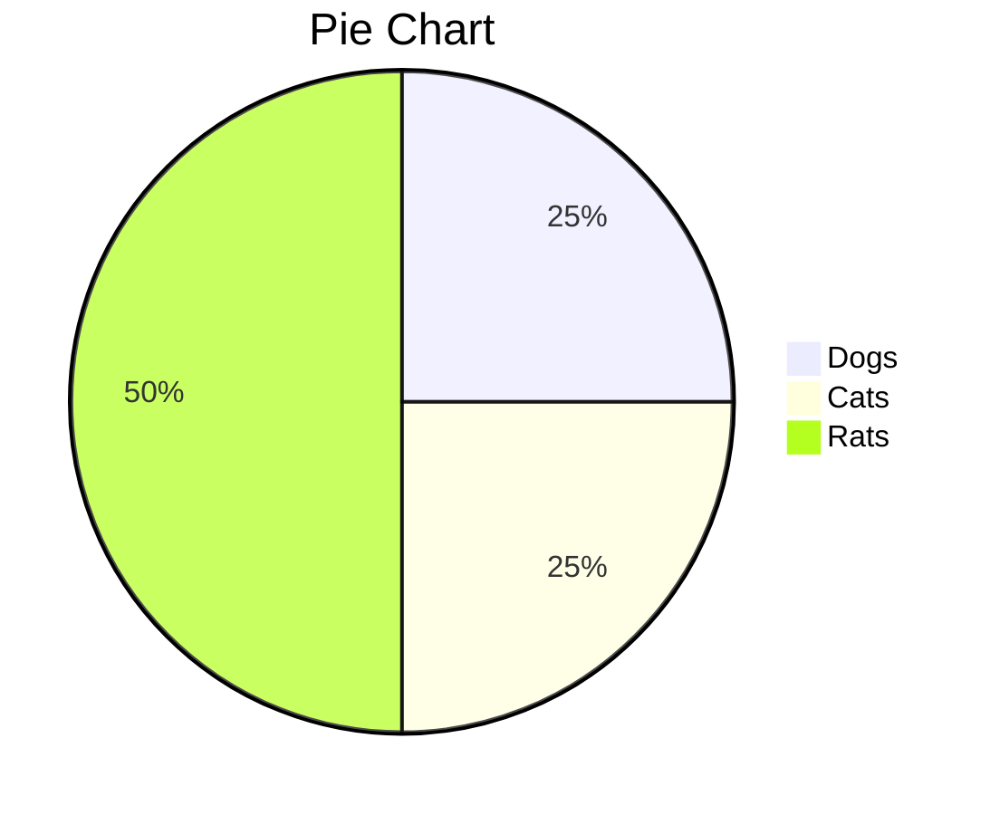

<span  style="font-family: Simsun,serif; font-size: 17px; ">

- [教程](https://daringfireball.net/projects/markdown/syntax)

```
使用 <kbd>Ctrl</kbd>+<kbd>Alt</kbd>+<kbd>Del</kbd> 重启电脑
```

使用 <kbd>ctrl</kbd>+<kbd>alt</kbd>+<kbd>del</kbd> 重启电脑

---

- 参考文档

~~~mermaid
graph TD
    id[带文本的矩形]
    id4(带文本的圆角矩形)
    id3>带文本的不对称的矩形]
    id1{带文本的菱形}
    id2((带文本的圆形))
~~~

---

~~~mermaid
graph TD
   A --> B
~~~

--

```sequence
Alice->Bob: Hello Bob, how are you?
Note right of Bob: Bob thinks
Bob-->Alice: I am good thanks!
```

---

$$
\begin{align*}
y = y(x,t) &= A e^{i\theta} \\
&= A (\cos \theta + i \sin \theta) \\
&= A (\cos(kx - \omega t) + i \sin(kx - \omega t)) \\
&= A\cos(kx - \omega t) + i A\sin(kx - \omega t)  \\
&= A\cos \Big(\frac{2\pi}{\lambda}x - \frac{2\pi v}{\lambda} t \Big) + i A\sin \Big(\frac{2\pi}{\lambda}x - \frac{2\pi v}{\lambda} t \Big)  \\
&= A\cos \frac{2\pi}{\lambda} (x - v t) + i A\sin \frac{2\pi}{\lambda} (x - v t)
\end{align*}
$$

---


---

```
gantt
dateFormat YYYY-MM-DD
section S1
T1: 2014-01-01, 9d
section S2
T2: 2014-01-11, 9d
section S3
T3: 2014-01-02, 9d

```


```
graph LR
A-->B
```


```
sequenceDiagram
A->>B: How are you?
B->>A: Great!
```

```math
E = mc^2
```


```

```


</span>