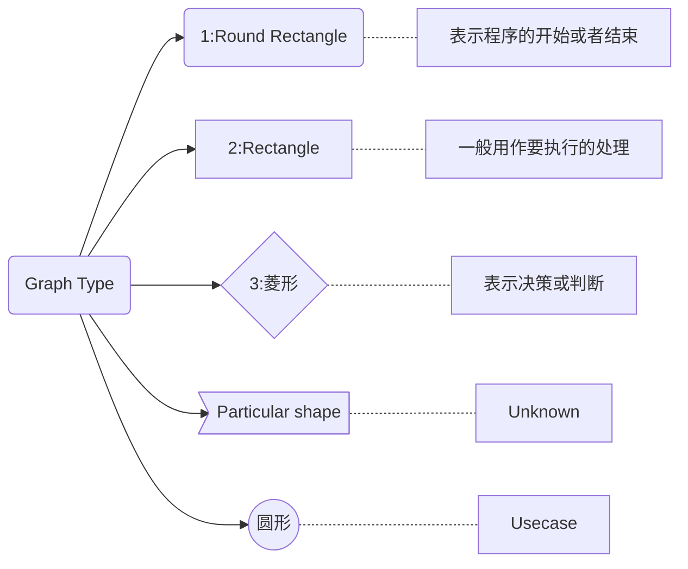

- 取决于markdown版本,git上或者 typora 可以打开

### 1. 单向

- 单向 -> 从上到下排列

- 单向 -> 从下到上排列

- 单向 -> 从上到下排列

- 单向 -> 从左到右排列

- 单向 -> 从右到左排列

### 2. 单向带 Content

- 单向带内容的

### 3. Shape 形状 ◇ ○ 长方形

- 各种形状

### 4. line

- 各种线条

### 5. Subgraph 子图 画一个区域?

- 子图?
- 区域图

### 6. Style 样式

- 上个色

