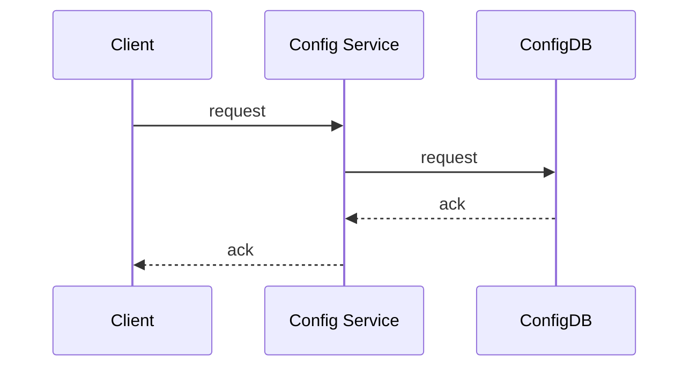
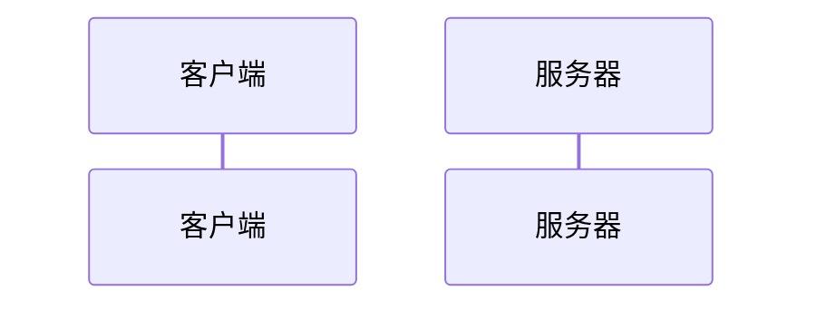

- 取决于markdown版本,git上或者 typora 可以打开

### 示例

- 双向

### 1. 双向

- sequenceDiagram 固定开头
- participant <参与者名称> 声明参与者，语句次序即为参与者横向排列次序

### 2. 消息

- 各种类型箭头

~~~mermaid
sequenceDiagram
    participant 老板A
    participant 员工A

    老板A ->> 员工A : “在这里我们都是兄弟！”
    老板A -x 员工A : 画个饼
    员工A -->> 老板A : 鼓掌
~~~

- 消息语句格式为：<参与者> <箭头> <参与者> : <描述文本>。
- 其中 <箭头>的写法有：
    - ->> 显示为实线箭头（主动发出消息）
    - -->>显示为虚线箭头（响应）
    - -x显示为末尾带「X」的实线箭头（异步消息）

### 3. 激活框

- 线上多个框吧,大概
- +- 做开关

~~~mermaid
sequenceDiagram
    老板B ->> + 员工B : “你们要669！”
    员工B -->> - 老板B : 鼓掌
    
    老板B ->> + 员工B : “悔创本司！”
    员工B -->> - 老板B : 鼓掌
~~~

### 4. 注解

- 指定区域放个便签

~~~mermaid
sequenceDiagram
    Note left of 老板A : 对脸不感兴趣
    Note right of 老板B : 对钱不感兴趣
    Note over 老板A,老板B : 对996感兴趣
~~~

### 5. 循环

- 在条件满足时，重复发出消息序列。相当于编程语言中的 while 语句。

~~~mermaid
sequenceDiagram
    网友 ->> + X宝 : 网购钟意的商品
    X宝 -->> - 网友 : 下单成功
    
    loop 一天七次
        网友 ->> + X宝 : 查看配送进度
        X宝 -->> - 网友 : 配送中
    end
~~~

### 6. 选择(alt)

- 在多个条件中作出判断，每个条件将对应不同的消息序列。相当于 if 及 else if 语句。

~~~mermaid
sequenceDiagram    
    土豪 ->> 取款机 : 查询余额
    取款机 -->> 土豪 : 余额
    
    alt 余额 > 5000
        土豪 ->> 取款机 : 取上限值 5000 块
    else 5000 > 余额 > 100
        土豪 ->> 取款机 : 有多少取多少
    else 余额 < 100
        土豪 ->> 取款机 : 退卡
    end
    
    取款机 -->> 土豪 : 退卡
~~~

### 7. 可选(opt)

- 不太明白

~~~mermaid
sequenceDiagram
    老板C ->> 员工C : 开始实行996
    
    opt 永不可能
        员工C -->> 老板C : 拒绝
    end
    
    opt 同意
        员工C -->> 老板C : 骗你的
    end
~~~

### 8. 并行(Par)

- 并行

~~~mermaid
sequenceDiagram
    倒霉老板 ->> 群员 : 开始上班
    
    par 并行
        群员 ->> 群员 : 刷微博
    and
        群员 ->> 群员 : 吹牛逼
    and
        群员 ->> 群员 : 刷朋友圈
    end
    
    群员 -->> 倒霉老板 : 6点下班
~~~

