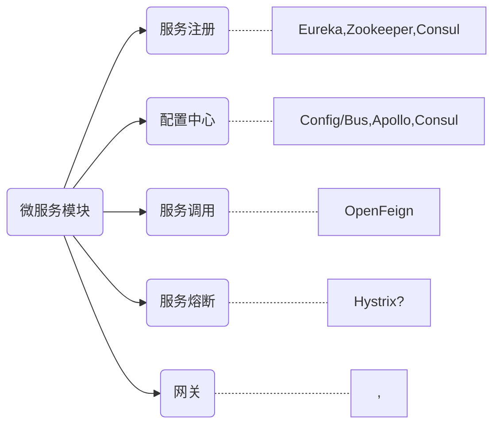

### 微服务基础模块

~~~
服务注册
配置中心
服务调用
服务熔断
网关
~~~

### 基础模块

```mermaid
graph LR
A1-1(微服务模块)-->A2-1(服务注册)
A2-1-.-A3-1[Eureka,Zookeeper,Consul]

A1-1(微服务模块)-->A2-2(配置中心)
A2-2-.-A3-2[Config/Bus,Apollo,Consul]

A1-1(微服务模块)-->A2-3(服务调用)
A2-3-.-A3-3[OpenFeign]

A1-1(微服务模块)-->A2-4(服务熔断)
A2-4-.-A3-4[Hystrix?]

A1-1(微服务模块)-->A2-5(网关)
A2-5-.-A3-5[,]


```

