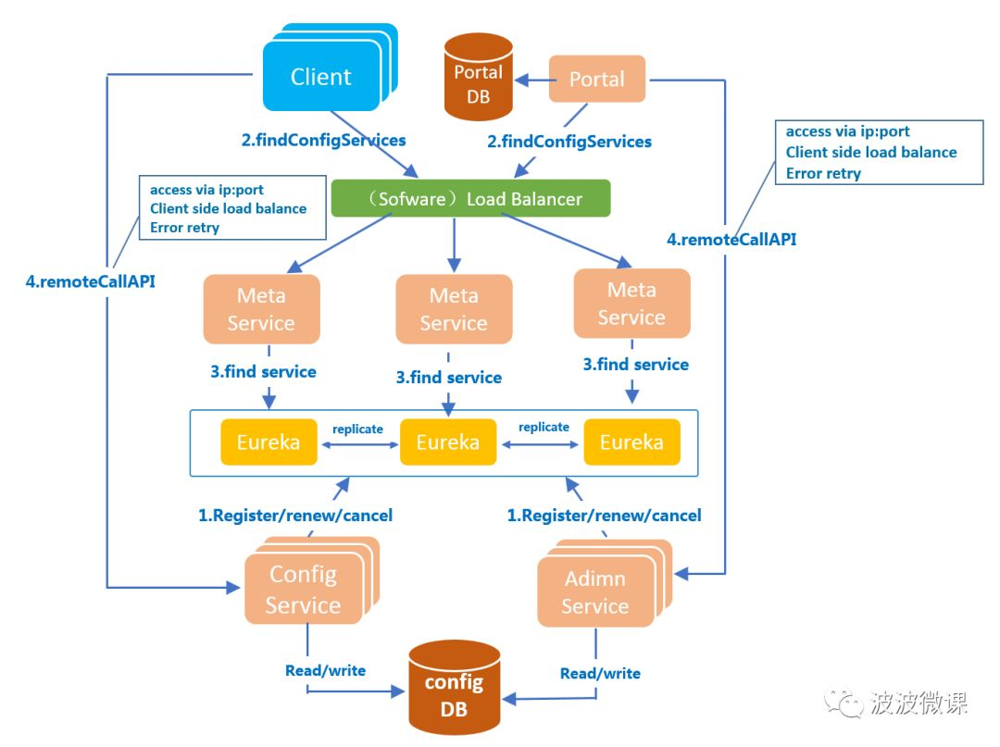

- [apollo-官网](https://www.apolloconfig.com/#/)
- [b站视频](https://www.bilibili.com/video/BV1xA411E7My)
- [Apollo-快速入门](https://www.apolloconfig.com/#/zh/development/apollo-development-guide)

### 简介

### 特性

- 分为服务端和客户端
- 统一管理不同环境，集群的配置
- 配置修改实时生效热发布
- 版本发布管理
- 灰度发布
- 权限管理，发布审核，操作审计
- 客户端配置信息监控

### 架构图

- 
- [架构解析](https://mp.weixin.qq.com/s/-hUaQPzfsl9Lm3IqQW3VDQ)
- [架构模块](https://www.apolloconfig.com/#/zh/design/apollo-design?id=_12-%e6%9e%b6%e6%9e%84%e6%a8%a1%e5%9d%97)

### 概念

