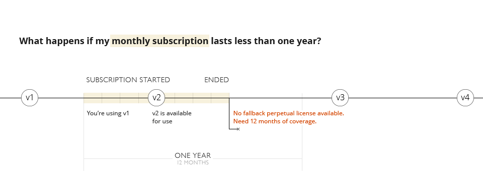
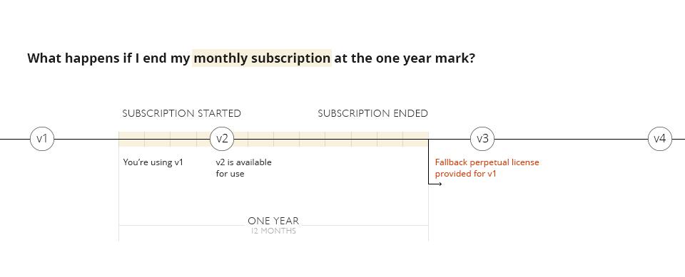

- [永久回退许可证](https://sales.jetbrains.com/hc/zh-cn/articles/207240845-什么是永久回退许可证-)

~~~
借助永久回退许可证，您可以使用特定版本的软件，而不必拥有软件的有效订阅。 该许可证还包括所有错误修复更新，特别是 X.Y.Z 版本，所有的 Z 版本更新都包含在内。
如果您按月付款，连续支付 12 个月后，您会立即获得此永久回退许可证，它会为您提供连续 12 个月订阅开始时获得的确切产品版本的访问权限。 您将会收到为其连续 12 个月付款的每个版本的永久回退许可证。
~~~

- [订阅许可证用户-可使用的最新版本等信息](https://account.jetbrains.com/login)

~~~
如果您是订阅许可证用户，订阅到期后您可以继续使用的版本会显示在主登录页面：
~~~

- 可使用情况说明
- 不足一年
- 
- 够一年
- 

