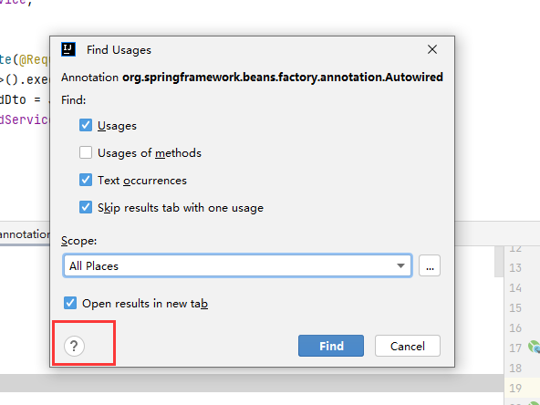
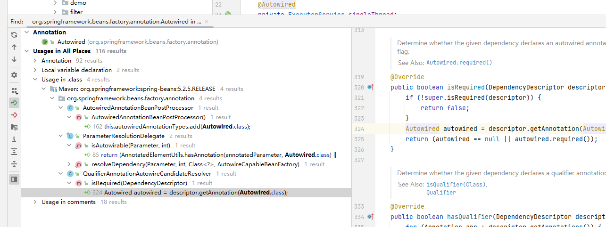

### 快捷键

~~~
- ctrl + shift + '+-'
- 打开合并方法
- 查找类 ctrl+ N
- 清除多余引用 ctrl + alt + o
- 显示类结构，(查找方法) ctrl+F12
- 全局搜索 shift * 3
- 搜索带后缀名文件内容(正则查找) ctrl + shift + F
- 分类型搜索 (正则查找) ctrl + shift + R
- 回到上一步 ctrl + alt + <-
- 回到下一步 ctrl + alt + ->
- shift alt s 类名
- ctrl + G 跳转行
~~~

### find usage

- [说明文档](https://www.jetbrains.com/help/idea/2022.1/find-usages-class-options.html)
- 
~~~
alt + F7
如果class找不到的话可以在左下角配置
~~~
- 

