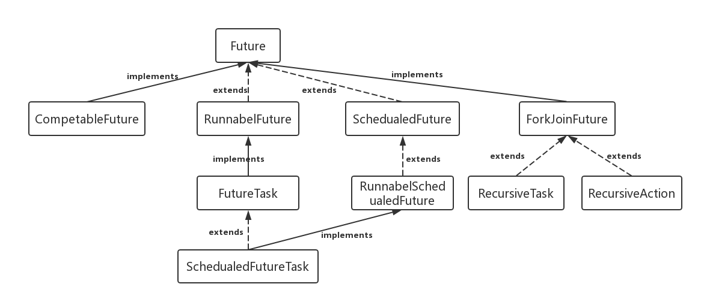

- [Future类详解](https://blog.csdn.net/bobozai86/article/details/123978048)

### Future

- 非阻塞模型
  

#### RunnableFuture

- 这个接口同时继承Future接口和Runnable接口，在成功执行run（）方法后，可以通过Future访问执行结果。这个接口都实现类是FutureTask,一个可取消的异步计算，这个类提供了Future的基本实现，后面我们的demo也是用这个类实现，它实现了启动和取消一个计算，查询这个计算是否已完成，恢复计算结果。计算的结果只能在计算已经完成的情况下恢复。如果计算没有完成，get方法会阻塞，一旦计算完成，这个计算将不能被重启和取消，除非调用runAndReset方法。
- FutureTask能用来包装一个Callable或Runnable对象，因为它实现了Runnable接口，而且它能被传递到Executor进行执行。为了提供单例类，这个类在创建自定义的工作类时提供了protected构造函数。

#### SchedualFuture

- 延时的行为
- 可以被取消
- 通常一个安排好的future是定时任务SchedualedExecutorService的结果

#### CompleteFuture

- 一个Future类是显示的完成，而且能被用作一个完成等级，通过它的完成触发支持的依赖函数和行为。当两个或多个线程要执行完成或取消操作时，只有一个能够成功。

#### ForkJoinTask

- 基于任务的抽象类，可以通过ForkJoinPool来执行。一个ForkJoinTask是类似于线程实体，但是相对于线程实体是轻量级的。大量的任务和子任务会被ForkJoinPool池中的真实线程挂起来，以某些使用限制为代价。

### 主要函数

#### get()

- 方法可以当任务结束后返回一个结果，如果调用时，工作还没有结束，则会阻塞线程，直到任务执行完毕

#### cancel

- 方法可以用来停止一个任务，如果任务可以停止（通过mayInterruptIfRunning来进行判断），则可以返回true,如果任务已经完成或者已经停止，或者这个任务无法停止，则会返回false.

#### isDone

- 方法判断当前方法是否完成

#### isCancel

- 方法判断当前方法是否取消

