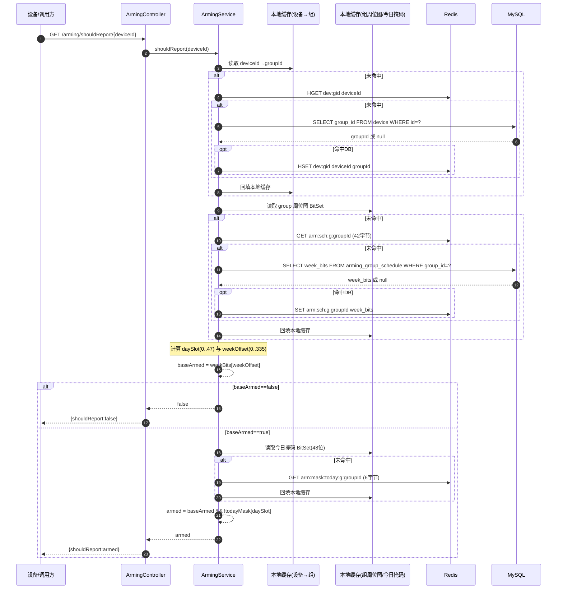
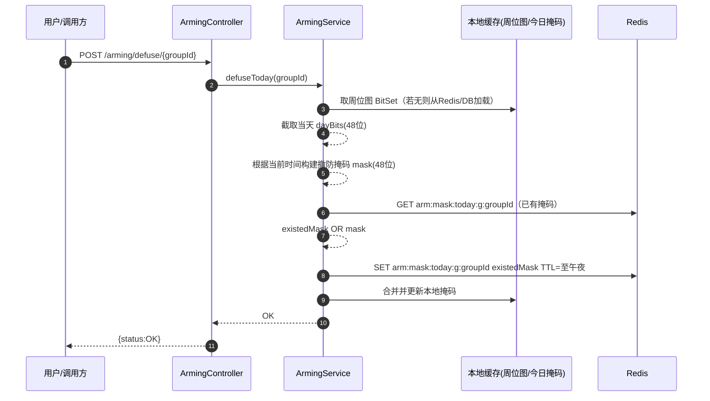
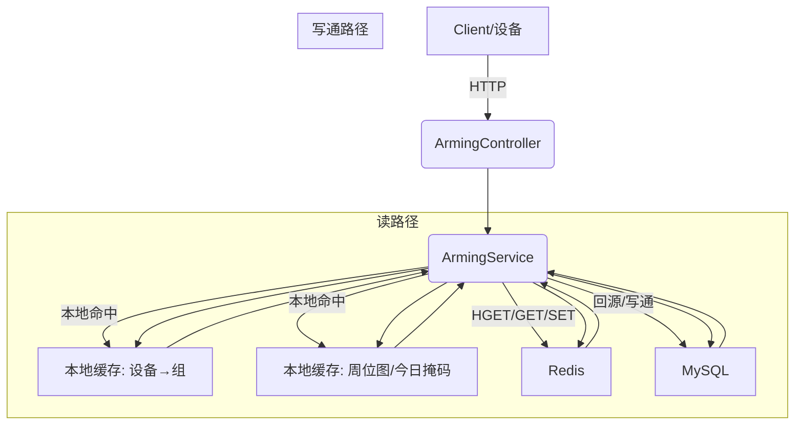

# 布防/撤防 时序图与交互图

## 判定是否上报（shouldReport）- 时序图

## 今日撤防（defuse）- 时序图

## 组件交互图（读/写路径）

## 时间槽与偏移计算
- daySlot = hour × 2 + (minute ≥ 30 ? 1 : 0) ∈ [0,47]
- weekDayIndex = (Mon=1..Sun=7) % 7 ∈ [0,6]
- weekOffset = weekDayIndex × 48 + daySlot ∈ [0,335]

> 注：Asia/Shanghai 时区，午夜自动切换，今日掩码 TTL 设为“距午夜剩余时长”。
